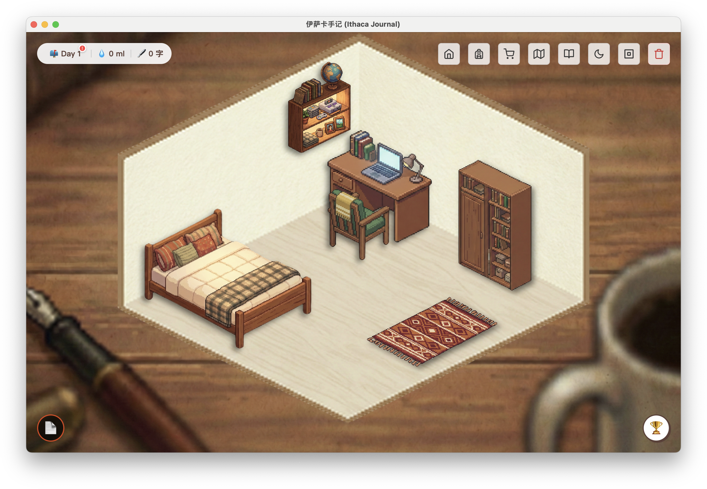

# 🍍 The Ithaca Journal | 伊萨卡手记
   

---

## 📖 关于本项目 (About)


**《伊萨卡手记》** 是一款融合了**叙事理论（Narrative Theory）**与**游戏化机制**的桌面端日记应用。

在这个快节奏的数字时代，我们试图通过构建一个虚拟的“精神避难所”，帮助用户找回书写的力量。这不仅仅是一个文本编辑器，更是一场为期 **21天** 的寻找自我的旅程。

在这里，你既是**书写者**，也是**玩家**。

### ✨ 核心特性 (Features)

* **✍️ 沉浸式写作体验**：
    * 无干扰的写作界面，支持 Markdown 语法。
    * 字数积累转化为“探索能量”，解锁新的剧情碎片。
* **🏠 你的伊萨卡（房间系统）**：
    * 随时间变化的虚拟房间，从最初的空荡荡到充满生活气息。
    * **书架+信箱**：收藏你的作品，以及那些神秘的“系统来信”。
* **🏙️ 城市漫游 (City Exploration)**：
    * 当写作遇到瓶颈时，去虚拟的城市街道散步。
    * 在便利店、公园、地铁站收集灵感碎片（Fragments）。
* **🧩 叙事合成 (Synthesis System)**：
    * 收集散落在城市里的《糖水菠萝日记》残页。
    * 在工作台将碎片重组，还原出前任房客的故事，并获得关于“自我”的哲学启示。
* **📅 21天习惯养成**：
    * 基于心理学的 21 天周期设计，每天解锁不同的信件与指引。
    * 从“叙事与自我”到“叙事与社会”，逐步深化。

---

## 🛠️ 技术栈 (Tech Stack)

本项目基于 **Electron** 框架构建。

* **Core**: Electron (Main/Renderer Process)
* **Frontend**: HTML5, CSS3 (Grid/Flexbox), Vanilla JavaScript (ES6+)
* **Data Persistence**: Node.js File System (fs) & LocalStorage
* **Markdown Engine**: `marked.js`

---

## 🚀 快速开始 (Getting Started)

如果你想在本地运行这个房间，请按照以下步骤操作：

### 1. 环境准备
确保你的电脑上安装了 [Node.js](https://nodejs.org/) (建议 v16+)。

### 2. 获取代码
```bash
git clone [https://github.com/your-username/ithaca-journal.git](https://github.com/your-username/ithaca-journal.git)
cd ithaca-journal
```

### 3. 安装依赖
```bash
npm install
```

### 4. 启动伊萨卡
```bash
npm start
```

目前项目仍在开发中，主要正在完善以下模块：

[ ] 故事主线与支线

[ ] 城市探索

[ ] 房间美术设计

[ ] 导出故事为 PDF 功能

[ ] 回收站

如果你对叙事理论或独立游戏开发感兴趣，欢迎提交 Issue 或 PR！